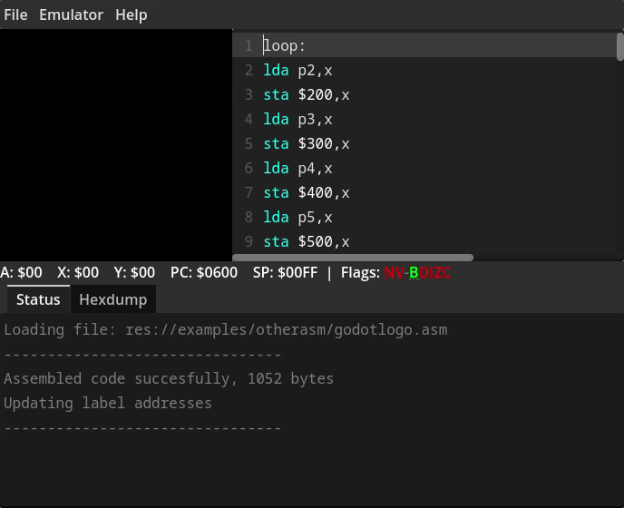

# GD6502 IDE
A bare-bones [6502](https://en.wikipedia.org/wiki/MOS_Technology_6502) emulator, with syntax highlighted code editing and basic debugging. Currently, I'm using the 6502asm.com and the [Easy 6502](https://skilldrick.github.io/easy6502/) emulators as goal posts to test GD6502's usefulness. After it's fully compatible with those two emulators, I'll work on making it compatible with more complex 6502-based systems like the Atari 2600, NES, and others.

## Core
The core 6502 emulation component has been moved to its own repository [here](https://github.com/eggbertx/GD6502). This repository is used for basic demonstration and unit testing.

## Examples
- The examples in [./examples/6502asm/](./examples/6502asm/) come from 6502asm.com (no longer active) and credit goes to their original authors.
- The examples in [./examples/otherasm/](./examples/otherasm/) are for general assembler testing and may or may not be moved to the unit testing directory.

## Tests
There are unit tests in [./test](./test/) that can be executed using [gdUnit4](https://mikeschulze.github.io/gdUnit4/). Running this from the command line generates a report, which can be found in a subdirectory of ./reports/

To use it, run `godot --path . -d -s ./addons/gdUnit4/bin/GdUnitCmdTool.gd --add ./test/`

For more command line usage info run the above, replacing `-add ./test/` with `-help` or `--help-advanced`, or see the [tutorial](https://mikeschulze.github.io/gdUnit4/advanced_testing/cmd/).

## Used assets
* The Godot logo in GD6502's icon is owned by the developers of the [Godot game engine](https://godotengine.org/) and licensed under the [Creative Commons Attribution 4.0 International](https://github.com/godotengine/godot/blob/master/LOGO_LICENSE.txt) license.
* The Noto Sans Monospace font (used for the assembly editor and status log) is developed by the Noto Fonts Project, and is licensed under the [SIL Open Fonts License](https://github.com/notofonts/noto-fonts/blob/main/LICENSE).
